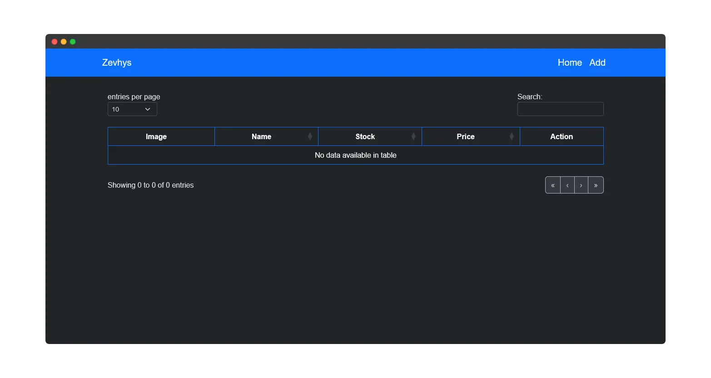

# product-catalogue 
        
 
A simple stock management system built with Node.js, Express.js, and MongoDB. This application allows users to perform CRUD operations for managing product information including name, stock, price, and image. The app also includes a bit input validation.

  

# Tech Stack 

# Requirements
<pre>
# Clone Repository
git clone https://github.com/Zevhys/product-catalogue .

# Install Dependencies
npm install

# Start MongoDB
- mongod
- mongosh

# Environment Variables 
connects to a MongoDB Compass database named `crud` hosted locally.

# Run The Application
- node index.js
- Visit http://localhost:7000 

# Running ESLint
- npx eslint .
</pre>

# Image Sizing Guide
For optimal image quality and performance, please refer to our comprehensive image sizing documentation:

- **📖 [Complete Guide (Indonesian)](IMAGE_SIZING_GUIDE.md)** - Panduan lengkap dalam Bahasa Indonesia
- **📖 [Complete Guide (English)](IMAGE_SIZING_GUIDE_EN.md)** - Complete guide in English  
- **⚡ [Quick Reference](IMAGE_SIZING_QUICK_REF.md)** - Quick reference card (bilingual)

**TL;DR:** Upload product images at **1400 × 1400 px** (square, JPEG 80% quality, < 1MB) for best results.

# Contribution
Contributions are welcome! If you have suggestions for improvements or want to report an issue, feel free to open a pull request or create an issue. Thank you for helping to make this project better!
