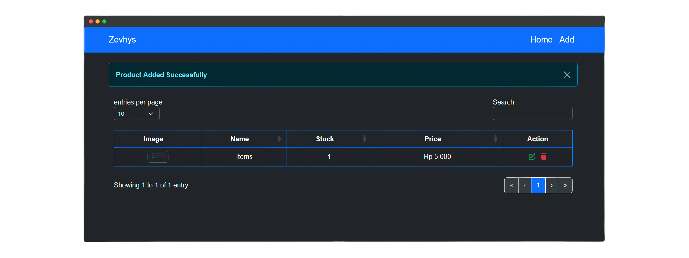

# product-catalogue [](https://github.com/Zevhys/product-catalogue/actions/workflows/codeql.yml) [](https://github.com/Zevhys/product-catalogue/actions/workflows/eslint.yml)
 
A simple stock management system built with Node.js, Express.js, and MongoDB. This application allows users to perform CRUD operations for managing product information including name, stock, price, and image. The app also includes a bit input validation.

<div align="center">
  
</div>

# Tech Stack 


# Installation
```bash
# Install dependencies
npm install

# Start MongoDB
- mongod
- mongosh

# Environment Variables 
connects to a MongoDB Compass database named `crud` hosted locally.

# Run the application
node index.js
Visit http://localhost:7000 
```
